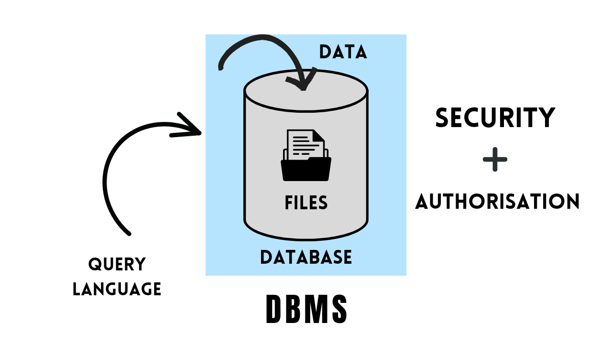
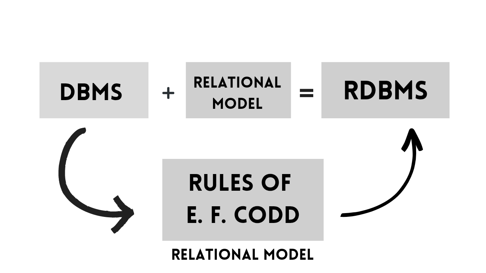
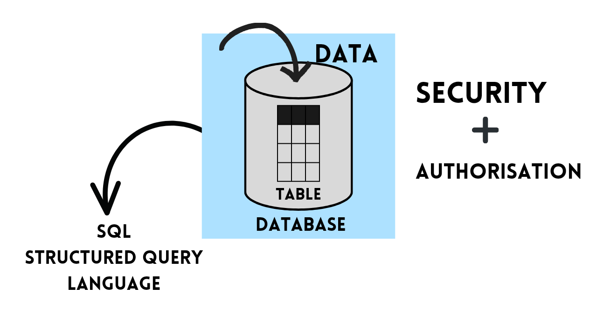

# Introduction to SQL

- **DATA :** It is a collection of information (or) a valid information.
- **ENTITY :** It suits for both living & non living things

## Database :

 - Database is a place (or) medium, where we can store data in systamatic and organised manner.  We can perform four operations on the database, they are **Create/Insert, Read/Retrive, Update/Modify, Delete/Drop**. These operations are universally referred as **'CRUD'** operations.

## Database Management System : [DBMS]

* DBMS is a software which is used to maintain and manage the database. In DBMS data is stored in the form of files.
* DBMS provides two important features they are security & authorisation.
* Query language is used to interact (or) communicate with DBMS.

### Types of DBMS :

* Network DBMS
* Hirarchial DBMS
* Object oriented DBMS
* Relational DBMS

## Relational model :

* In the year 1970's a data scientist called **E.F. CODD** (Edgar franklin codd) suggested that data can be stored in the form of tables and invented a model called relational model.
* If any DBMS follows relational model it becomes RDBMS.
* If any DBMS follows the rules of E.F. CODD, it becomes RDBMS

* RDBMS is a types of DBMS software. It is used to maintain and manage the database.
* RDBMS provides two important features security and authorisation.
* In RDBMS data is stored in the form of tables and it uses a language called SQL (Structured query language).

## Rules of E.F. Codd :

**Rule 1**

- Data enter into the cell must be single value **(Atomic rule)** [to avoid data lose, we use / enter single value in the cell].
  - Table is a logical arrangement of rows and columns.

**Rule 2** 

- we can store data in multiple tables if required we can establish a connection (or) relation between the tables with the help **Key Attributes**

**Rule 3** 

- In RDBMS all the data should be stored in the form of tables including **Meta Data**
  - **Meta Data** Details of the data is known as meta data (or) the meta data is a raw fact which describes the attributes of data.
  - **Meta Data** is stored in a table called **Meta Table**.
  - **Meta tables** are auto-generated.

**Rules 4** 

- Data enter into the table must be validated (cross checking).
**Two methods for data validation**
- By assigning Data types 
- By assigning Constraints.
- Data types are mandatory but constraints are optional.

> **Note**
> SQL is case insensitive language

# DataTypes

- Data types are used to specify what type of data can be stored in particular memory location.
  * CHAR()
  * VARCHAR()/VARCHAR2()
  * NUMBER()
  * DATE
  * LARGE OBJECT
    1. character large object (CLOB)
    2. Binary large object (BLOB)

## 1. CHAR() :

* CHAR() datatype can accept **'A_Z', 'a-z', special char, '0-9', alpha-numeric**.
* Char() datatype follows **fixed length memory allocation system**.
* In char() datatypes unused memory will become memory wastage.
* In char() datatype, we can store upto 2000 character.

### SYNTAX :

> ## ` CHAR(SIZE)`

### SIZE :

* Size is used to specify the total number of blocks required to store the memory.

## 2. VARCHAR() :

* VARCHAR() Datatype can accept **'A_Z', 'a-z', special char, '0-9', alpha-numeric**.
* VARCHAR() follows **Variable length memory allocation system**.
* In the VARCHAR() unused memory is a free memory.
* In VARCHAR() we can store upto 2000 characters.

### SYNTAX :

> ## ` VARCHAR(SIZE)`

## 2.1 VARCHAR2() :

* VARCHAR2() is the updated version of varchar(), in which we can store upto 4000 characters. 

## 3. Number() :

* This datatype is used to store the numerical values.

* For number datatypes we can pass two arguments **(INPUTS)** precession, scale.

### precession :

* precession is used to specify the total number of integers that can be stored in a memory.
* precession ranges from **1 to 38**, it does not have any default value.

### scale :

* Scale is used to specify the total number of decimal (or) floating values, that can be stored within the **Precession**.
* Scale ranges form **-84 to 127**, its default value is **0 (ZERO)**.

### SYNTAX

> ## `NUMBER(PRECESSION, [SCALE])`